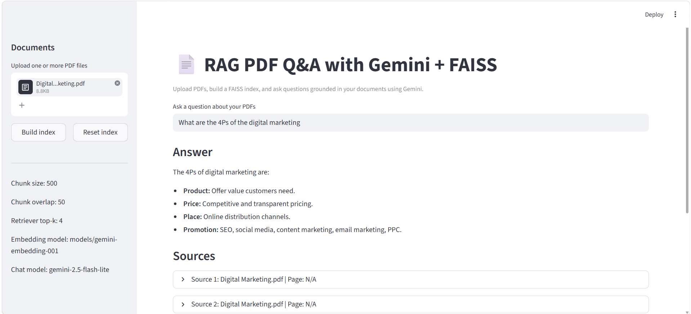
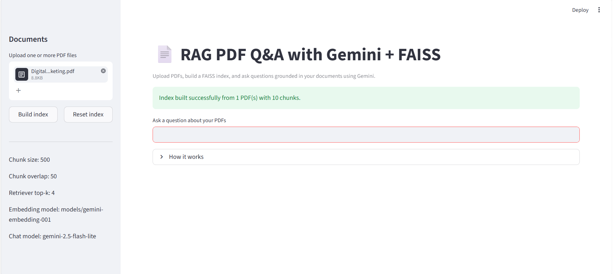

# RAG PDF Q&A with Gemini + FAISS

A Streamlit-based Retrieval-Augmented Generation (RAG) application that lets users upload PDF documents and ask questions about them using LangChain, FAISS, and Gemini.

The app extracts text from PDFs, splits it into chunks, creates embeddings, stores them in a FAISS vector database, and uses Gemini to generate answers grounded in the uploaded documents.

---

## Features

- Upload one or more PDF files.
- Extract text from PDFs using `UnstructuredPDFLoader`.
- Split text into chunks using `RecursiveCharacterTextSplitter`.
- Create embeddings with Gemini embeddings.
- Store and search vectors with FAISS.
- Ask questions in a Streamlit web interface.
- Display source passages used to answer the question.
- Simple and beginner-friendly local setup.

---

## Tech Stack

- Python
- Streamlit
- LangChain
- FAISS
- Gemini API
- langchain-google-genai
- UnstructuredPDFLoader
- RecursiveCharacterTextSplitter
- python-dotenv

---

## Project Structure

```bash
rag-qa-system-gemini/
├── app.py
├── requirements.txt
├── .env
├── .gitignore
├── README.md
├── DEPLOY.md
└── data/
```

---

## Setup

### 1. Clone the repository

```bash
git clone https://github.com/your-username/rag-qa-system-gemini.git
cd rag-qa-system-gemini
```

### 2. Create a virtual environment

```bash
python -m venv .venv
```

### 3. Activate the virtual environment

#### Windows

```bash
.venv\Scripts\activate
```

#### macOS / Linux

```bash
source .venv/bin/activate
```

### 4. Install dependencies

```bash
pip install -r requirements.txt
```

### 5. Create the `.env` file

Create a file named `.env` in the **project root folder** and add your Gemini API key:

```env
GOOGLE_API_KEY=your_gemini_api_key_here
```

You can copy `.env.example` and rename it to `.env`.

---

## How to Run

After setup is complete, start the app with:

```bash
streamlit run app.py
```

Then open the local URL shown in the terminal, usually:

```bash
http://localhost:8501
```

---

## How It Works

1. Upload a PDF file.
2. The app extracts text from the PDF.
3. Text is split into chunks of 500 characters with 50 overlap.
4. Chunks are converted into embeddings using Gemini.
5. Embeddings are stored in FAISS.
6. When you ask a question, FAISS retrieves the most relevant chunks.
7. Gemini generates an answer based on the retrieved context.
8. The app shows the answer and source chunks.

---

## Model Configuration

Current working model setup:

- Embeddings: `gemini-embedding-001`
- Chat model: `gemini-2.5-flash-lite`

If Google changes model availability or rate limits, you may need to update these values in `app.py`.

---

## Deployment

### Streamlit Community Cloud

1. Push this repository to GitHub.
2. Go to Streamlit Community Cloud.
3. Create a new app from your repository.
4. Set the main file path to `app.py`.
5. Add `GOOGLE_API_KEY` in Secrets or environment variables.
6. Deploy the app.

### Render

1. Create a new web service from GitHub.
2. Use Python runtime.
3. Build command:

```bash
pip install -r requirements.txt
```

4. Start command:

```bash
streamlit run app.py --server.port=$PORT --server.address=0.0.0.0
```

5. Add `GOOGLE_API_KEY` as an environment variable.
6. Deploy.

---

## Limitations

- Free-tier Gemini usage may have rate limits.
- Scanned PDFs may not extract perfectly.
- Answers depend on the quality of the uploaded document text.
- Hallucinations may still happen if retrieval is weak or context is incomplete.

---

## Screenshots

Add screenshots here after running the app:

### Home Screen


### Upload Screen


### Answer Screen


---

## Future Improvements

- Add chat history.
- Add better source citation formatting.
- Support DOCX and TXT files.
- Improve retrieval quality with smarter chunking.
- Add multi-PDF filtering.
- Add a nicer UI.

---

## Why This Project

This project demonstrates:
- RAG pipeline understanding
- PDF text extraction
- vector database usage
- Gemini API integration
- Streamlit app development
- practical debugging and iteration

---

## License

This project is open for learning and portfolio use.